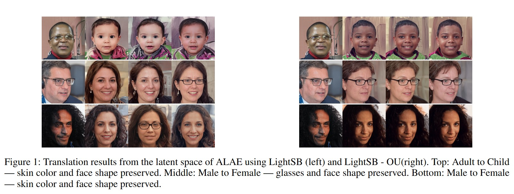

# Tight Bounds for Schrödinger Potential Estimation in Unpaired Image-to-Image Translation Problems

This repository contains the `PyTorch` code to reproduce the experiments from work **Tight Bounds for Schrödinger Potential Estimation in Unpaired Image-to-Image Translation Problems** by  [Nikita Puchkin](https://scholar.google.com/citations?hl=en&user=xc8HXnMAAAAJ), [Denis Suchkov](https://scholar.google.com/citations?user=whaT9tkAAAAJ&hl=en), [Alexey Naumov](https://scholar.google.com/citations?user=5723KoYAAAAJ&hl=en) and [Denis Belomestny](https://scholar.google.com/citations?user=WFjIBlcAAAAJ&hl=en).

**An example:** Our modification of LightSB-OU using the Ornstein-Ulebneck process allows us to easily improve the results of latent space transport.

<p align="center"></p>

## The repository is organized as follows:
The LightSB-OU and original LightSB code is in `src/` along with some helper .py scripts. The experiments are in the `notebooks/` folder and when run, they reproduce all the illustrations and graphs used in the article.

```notebooks/LightSB_OU_ALAE.ipynb``` - Code for image experiment with ALAE.

```notebooks/LightSB_OU_single_cell.ipynb``` - Code for single cell experiment.

```notebooks/LightSB_OU_25_Gauss_Standard.ipynb``` - Code for Standard 25 Gaussians mixture experiment.

```notebooks/LightSB_OU_25_Gauss_Irregular.ipynb``` - Code for Irregular 25 Gaussians mixture experiment.

```notebooks/LightSB_OU_25_Gauss_Anisotropic.ipynb``` - Code for Anisotropic 25 Gaussians mixture experiment.

```ALAE``` - Code for the ALAE model.

```src``` - LightSB-OU and original LightSB implementationы and helper .py scripts.

## Citation

    @misc{puchkin2025tightboundsschrodingerpotential,
          title={Tight Bounds for Schr\"odinger Potential Estimation in Unpaired Image-to-Image Translation Problems}, 
          author={Nikita Puchkin and Denis Suchkov and Alexey Naumov and Denis Belomestny},
          year={2025},
          eprint={2508.07392},
          archivePrefix={arXiv},
          primaryClass={cs.LG},
          url={https://arxiv.org/abs/2508.07392}, 
    }
